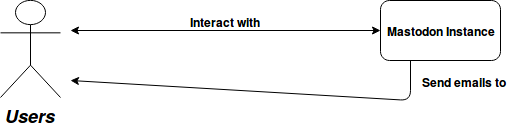
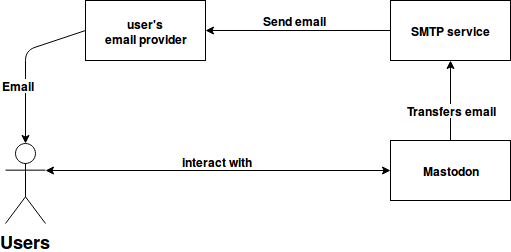
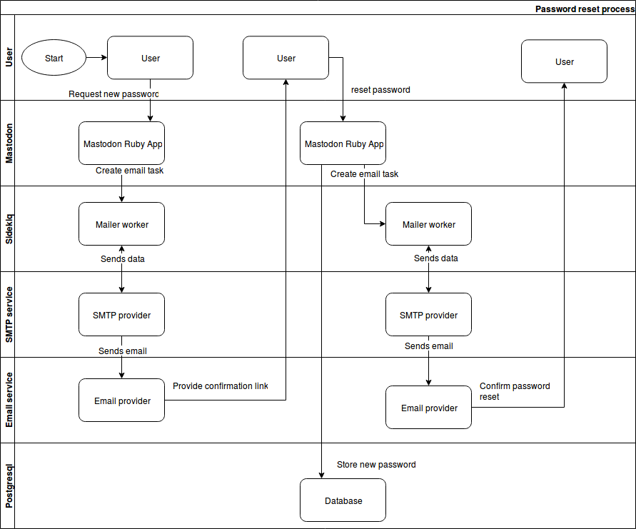

Diagrams
=====

This document highlight when emails are used and what the process looks like.
 
### What is email used for in Mastodon?
By default, email is sent to confirm new user accounts. Users can also choose to receive interaction notifications via email. Finally password reset and password reset confirmation is done via email.

### Flow diagram
From the user's perspective, emails come from Mastodon This is a one-way relationship: the user never sends email to Mastodon.

The email system has two parts. One is within the user realm, as they choose their email provider.
On the other hand, the SMTP is in administrator realm as they control the SMTP service used.

The mastodon system is also made of few systems.
There is a webserver, two backend applications, multiple data stores and task workers.

### Sign up process
When a user sign up for an account on an instance, the Mastodon app store a task in Redis. The Sidekiq mailer worker pick that task and deliver the email to the SMTP service. The SMTP service would then send the email to the user's email provider.
The user then click the confirmation link that trigger a task to set the email as verified in the database

### Notification process

### Password reset process
When a user request a password reset the Mastodon app store a task in Redis. The Sidekiq mailer worker pick that task and deliver the email to the SMTP service.
The SMTP service would then send the email to the user's email provider.
The user then click the reset link in the email.
The user prompted for a new password by the Mastodon app. The app stores the new passord on successul passord reset.
The Mastodon app store a task in Redis to inform the user via email of the change.The Sidekiq mailer worker pick that task and deliver the email to the SMTP service. The SMTP service would then send the email to the user's email provider.

